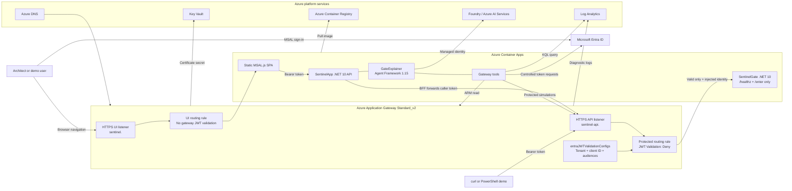
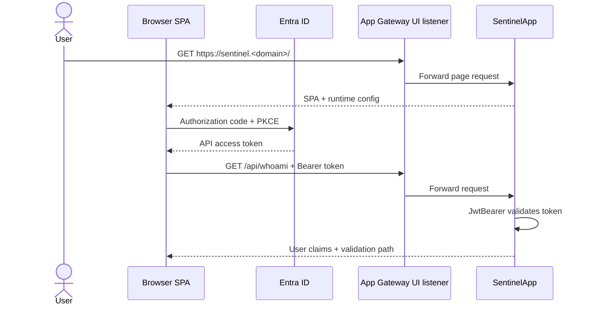
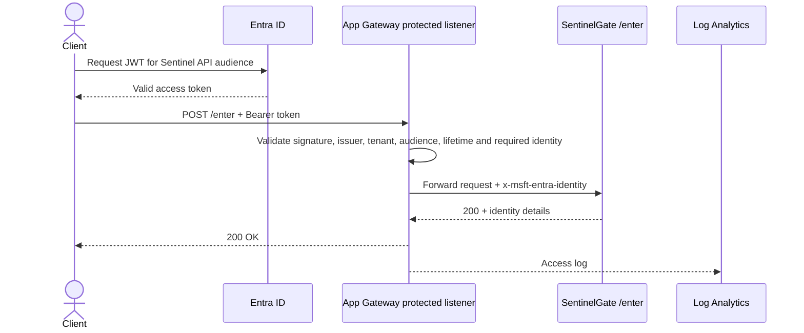
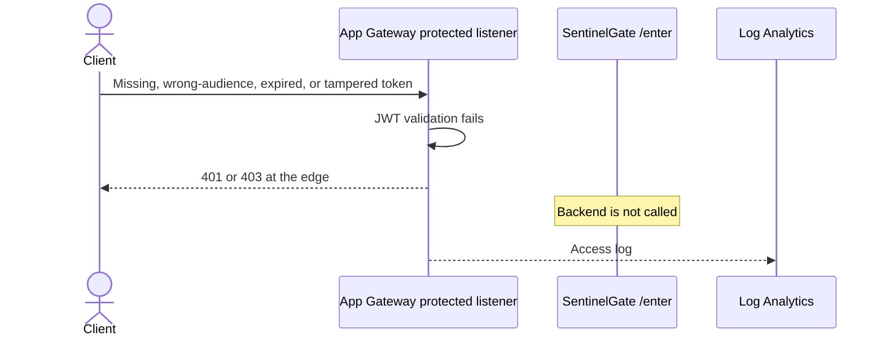

# JWT Sentinel — Clean Rebuild Design

**Document status:** Approved design baseline for the clean repository  
**Design version:** 2.0  
**Date:** 2026-08-04  
**Primary audience:** Solution architects, cloud engineers, coding agents, reviewers, and demo operators

## 1. Executive summary

JWT Sentinel is an AI-enhanced demonstration of Azure Application Gateway JWT Validation. The application is intentionally self-referential: Azure Application Gateway validates Microsoft Entra ID access tokens at the edge, while the application behind it explains what the gateway validated, shows the identity injected into the backend request, queries real access logs, and runs controlled allow/deny scenarios.

This document defines a **clean, independent rebuild** of the proven solution in a new repository and a new Azure environment. The existing deployment remains untouched.

The rebuild preserves the successful architecture:

- Azure Application Gateway Standard_v2 with JWT Validation configured through AzAPI.
- Two HTTPS hostnames on one gateway with structurally isolated SentinelApp and SentinelGate Container App backends.
- A .NET 10 minimal API with a static MSAL.js single-page application.
- Microsoft Agent Framework 1.15 with an in-process `GateExplainer` agent.
- Microsoft Foundry/Azure AI Services for the model deployment.
- Three Microsoft Entra applications: API, SPA, and daemon.
- Log Analytics, Key Vault, Azure Container Registry, and managed identities.
- Terraform for infrastructure and PowerShell for application deployment, certificate issuance, and demo scenarios.

The rebuild changes the **environment and operational discipline**, not the core product behavior:

- New local folder and repository.
- No inherited Git remote.
- No copied Terraform state or `.terraform` metadata.
- New Terraform variables and resource prefix.
- New Azure DNS zone or new isolated hostnames.
- New Entra applications.
- New Key Vault certificate.
- A fresh local state or a new explicitly unique remote-state key.
- No imports or dependencies on the running deployment.

## 2. Product statement

> JWT Sentinel explains Azure Application Gateway JWT Validation by placing an AI-enhanced diagnostic application behind the very gateway policy it demonstrates.

The primary teaching message is:

> Authentication can be enforced at the gateway edge, while the backend receives a trusted identity signal and the AI layer makes otherwise opaque allow/deny behavior understandable.

JWT Sentinel is a technical demonstration and learning asset. It is not a production identity platform, authorization framework, or generic token inspection service.

## 3. Source-of-truth hierarchy

The repository uses the following authority order:

1. The user's current instruction.
2. `AGENTS.md` for operating rules, safety constraints, and validation requirements.
3. The current code and executable tests.
4. This `DESIGN.md` for architecture and intended behavior.
5. `README.md` for deployment and operator guidance.
6. Historical session files and field notes.

The original design document contained open choices that were later resolved. This version records the implemented decisions and must not be interpreted as a return to the earlier alternatives.

## 4. Goals

### 4.1 Functional goals

The solution must:

1. Demonstrate gateway-level validation of Entra-issued JWT access tokens.
2. Reject missing, malformed, tampered, expired, wrong-issuer, or wrong-audience tokens before the protected request reaches the backend.
3. Forward valid traffic to the backend and expose the injected `x-msft-entra-identity` header.
4. Provide a browser UI that signs users in through MSAL using authorization code with PKCE.
5. Contrast gateway validation with conventional ASP.NET Core JwtBearer validation.
6. Allow users to decode a JWT and compare relevant claims with the live gateway configuration.
7. Query real Application Gateway access logs.
8. Run controlled request simulations through the protected listener.
9. Let an AI agent explain configuration, claims, logs, and simulation results in plain language.
10. Provide a repeatable scripted demo and an explicit acceptance-test matrix.

### 4.2 Rebuild goals

The clean rebuild must:

1. Create a fully independent Azure environment.
2. Avoid all changes to the running JWT Sentinel deployment.
3. Create new Entra applications and service principals.
4. Use new resource names, DNS names, and certificate material.
5. use a fresh Terraform state.
6. preserve all verified preview-feature workarounds.
7. make environment-specific values configurable.
8. produce a reviewed plan containing only new-environment changes.

### 4.3 Quality goals

The solution should be:

- Reproducible.
- Explainable.
- Secure by default for a public technical demo.
- Observable.
- Easy to destroy when no longer needed.
- Clear about preview limitations.
- Safe for coding agents to modify without weakening the security demonstration.

## 5. Non-goals

The first clean rebuild does not attempt to:

- Handle tokens from third-party identity providers.
- Replace application authorization with gateway authentication.
- Support arbitrary customer tenants or multitenancy.
- Operate production workloads.
- Provide a generic API management platform.
- Implement full Zero Trust policy evaluation.
- Replace Application Gateway with API Management, Front Door, or another reverse proxy.
- Move the agent to a separately hosted multi-agent runtime.
- Introduce private networking or a hub-and-spoke topology.
- Reuse the original Entra applications, DNS zone, state, or deployed Azure resources.
- Automatically migrate the running environment into the new repository.

## 6. Proven baseline and clean-rebuild changes

| Area | Proven implementation | Clean rebuild decision |
|---|---|---|
| Repository | Existing local repository | New local folder and new repository |
| Git | Existing history/remote may point to the original | Start without the original remote; add only the new repository remote |
| Terraform state | Existing deployment state | Fresh state; never copy or import the old state |
| State backend | Existing baseline may use local state | Local fresh state is acceptable initially; remote state must use a unique explicit key |
| Azure resources | Existing resource group and names | New prefix, resource group, random suffixes, and resource IDs |
| DNS | Existing demo domain/hostnames | New Azure DNS zone or new isolated domain and A records |
| Entra ID | Existing API, SPA, and daemon applications | Create three new applications |
| Application runtime | .NET 10 minimal API | Preserve |
| Agent runtime | Microsoft Agent Framework 1.15, in-process | Preserve |
| Frontend | Static SPA with locally vendored MSAL.js | Preserve |
| Gateway | Standard_v2 via AzAPI `2025-05-01` | Preserve |
| Backend | Azure Container Apps | Preserve |
| AI | Foundry/Azure AI Services deployment | Preserve, but keep model parameters configurable |
| TLS | Key Vault self-signed bootstrap followed by Let's Encrypt | Preserve |
| Demo | Four-scenario script plus browser agent | Preserve and expand into a formal acceptance matrix |
| Field workarounds | NAT, post-restart config push, safe API version | Preserve as mandatory design constraints |

## 7. High-level architecture



## 8. The two-plane design

The solution deliberately exposes two hostnames through the same gateway.

### 8.1 UI plane

Default hostname:

```text
sentinel.<domain>
```

Purpose:

- Serve the static SPA.
- Allow the unauthenticated page shell to load.
- Sign users in with MSAL.js.
- Call authenticated `/api/*` routes.
- Demonstrate standard in-application token validation using ASP.NET Core JwtBearer.

The UI routing rule does **not** apply Application Gateway JWT Validation to the initial browser navigation. Browsers do not attach bearer tokens to normal page loads, so protecting the page navigation with `Deny` would block the login experience itself.

The UI APIs remain authenticated. The SPA obtains an access token for the JWT Sentinel API and sends it in the `Authorization` header.

### 8.2 Gateway demonstration plane

Default hostname:

```text
sentinel-api.<domain>
```

Purpose:

- Demonstrate JWT validation at Application Gateway.
- Expose SentinelGate `/enter`.
- Reject invalid requests before the backend is called.
- Forward valid requests with `x-msft-entra-identity`.

The protected routing rule references the gateway's `entraJWTValidationConfig` and uses:

```text
unAuthorizedRequestAction = Deny
```

### 8.3 Structural backend isolation

The planes use separate Container Apps:

- SentinelApp serves the SPA and `/api/*`, authenticated by ASP.NET Core JwtBearer plus the delegated `access_as_user` scope.
- SentinelGate exposes only `/healthz` and `/enter`; the protected Application Gateway listener is its only route.
- SentinelApp forwards a signed-in caller token to `/enter` through a BFF endpoint because a browser cannot attach a bearer token to navigation and an unauthenticated CORS preflight could be denied at the gateway.
- The UI listener has no route to SentinelGate, and the protected listener has no route to SentinelApp.

The trust boundary is the dedicated protected listener and attached JWT `Deny` rule, the SentinelGate-only backend pool, Container Apps ingress restricted to Application Gateway egress, and strict canonical parsing of the gateway-injected `tenantId:objectId` value. Backend settings retain `pickHostNameFromBackendAddress = true`, so the actual backend `Host` and TLS/SNI name are the SentinelGate ACA FQDN. SentinelGate may compare client-originated `x-original-host` with the protected public hostname as an additional routing consistency check. A missing or mismatched value may be rejected, but a match is neither authentication nor proof of JWT validation.

## 9. Request flows

### 9.1 UI sign-in and authenticated API call



### 9.2 Valid request through the protected listener



### 9.3 Invalid request through the protected listener



## 10. Application design

### 10.1 Runtime

The application tier contains two .NET 10 ASP.NET Core minimal API deployments.

SentinelApp contains:

- Static SPA assets.
- Runtime SPA configuration.
- ASP.NET Core authentication and authorization.
- The authenticated BFF gateway-entry endpoint.
- Diagnostic tool endpoints.
- The in-process AI agent.
- Server-sent event streaming for agent responses.

SentinelGate contains only:

- `/healthz`.
- `/enter`.
- Original-host routing-context consistency checking; never authentication.
- Canonical injected-identity and expected-tenant validation.

SentinelGate has no SPA, Agent Framework, Foundry, Log Analytics, ARM Reader, daemon credential, or simulation dependencies.

### 10.2 API surface

| Route | Authentication path | Purpose |
|---|---|---|
| `GET /healthz` | None | Container and gateway health probe |
| `GET /config.js` | None | Runtime MSAL and endpoint configuration for the SPA |
| `POST /api/gate/enter` | ASP.NET Core JwtBearer plus `access_as_user` | Forwards the authenticated caller token to the protected hostname without persisting or exposing it |
| `POST /enter` on SentinelGate | Application Gateway JWT Validation plus strict host/header checks | Returns a minimal validated identity result |
| `GET /api/whoami` | ASP.NET Core JwtBearer | Shows the signed-in user's relevant claims and validation path |
| `POST /api/tools/decode` | ASP.NET Core JwtBearer | Decodes a supplied JWT without claiming cryptographic validation |
| `GET /api/tools/config` | ASP.NET Core JwtBearer | Reads the live gateway JWT configuration |
| `GET /api/tools/logs` | ASP.NET Core JwtBearer | Queries recent Application Gateway logs |
| `POST /api/tools/simulate` | ASP.NET Core JwtBearer | Runs a selected controlled gateway scenario |
| `POST /api/agent/chat` | ASP.NET Core JwtBearer | Streams an agent response using server-sent events |
| `POST /api/agent/reset` | ASP.NET Core JwtBearer | Clears an in-memory agent session |

### 10.3 Runtime configuration

The application receives environment-specific settings through Container Apps configuration, including:

- Tenant ID.
- API client ID.
- SPA client ID.
- Daemon client ID and secret reference.
- API audience URI.
- Gateway resource ID.
- Log Analytics workspace GUID.
- UI base URL.
- Protected API base URL.
- Foundry/Azure AI endpoint.
- Model deployment name.
- User-assigned managed identity client ID.

The browser receives only non-secret settings through `/config.js`.

### 10.4 Session model

Agent sessions are keyed by authenticated tenant/object identity plus a client-provided GUID and held in SentinelApp memory. Sessions expire after inactivity, have a bounded global count, and cannot be continued or reset by another authenticated user.

This is sufficient for the demonstration but has known limitations:

- Sessions are lost when the revision restarts.
- Multiple replicas do not share session state.
- SentinelApp therefore uses exactly one replica in this version. SentinelGate remains stateless and independently scalable.

A durable session store is a future enhancement, not a requirement for the clean rebuild.

## 11. GateExplainer agent

### 11.1 Purpose

The agent turns gateway behavior into an interactive explanation. It must ground responses in tool results rather than inventing configuration or telemetry.

The agent should be able to answer questions such as:

- Why was my request rejected?
- Which audience does the gateway accept?
- What identity did the gateway inject?
- What is the difference between the UI and protected listeners?
- Show what happens with a wrong-audience token.
- Decode this token and compare it with the active gateway policy.
- Why do logs not yet show the request I just sent?

### 11.2 Runtime

The agent runs in-process using Microsoft Agent Framework 1.15 and a model deployed in Microsoft Foundry/Azure AI Services.

Known implementation pattern:

```csharp
using OpenAI.Chat;

_agent = client
    .GetChatClient(deploymentName)
    .AsAIAgent(...);

AgentSession session =
    await _agent.CreateSessionAsync(cancellationToken);
```

The application uses managed identity to call the model endpoint.

### 11.3 Tools

#### `decode_token`

- Base64-decodes token header and payload.
- Extracts claims such as `iss`, `tid`, `aud`, `oid`, `exp`, and `nbf`.
- Compares relevant claims with the active gateway policy.
- Clearly states that decoding is not signature validation.
- Does not persist the token.

#### `get_gateway_config`

- Uses the Container App managed identity.
- Reads the live Application Gateway through Azure Resource Manager.
- Uses an API version that exposes `entraJWTValidationConfigs`.
- Returns the configured tenant, client ID, audiences, unauthorized action, and routing-rule reference.
- Must not infer settings when the ARM call fails.

#### `query_gate_logs`

- Uses the managed identity with Log Analytics Reader.
- Queries recent Application Gateway access logs.
- Surfaces status codes and request context useful for explaining allow/deny behavior.
- States that ingestion can lag behind the live request.

#### `simulate_gate_request`

- Uses the daemon application for controlled client-credential scenarios.
- Can reuse the signed-in user's token for a user-replay scenario.
- Calls the protected hostname and returns the actual status and response.
- Supports at least:
  - missing token;
  - correct API audience;
  - wrong audience;
  - tampered token;
  - user replay.

### 11.4 Agent safety and evidence rules

The agent must:

- Never expose the daemon secret.
- Never echo full tokens into logs or responses unless the user explicitly supplied the token for decoding, and even then avoid unnecessary repetition.
- Never claim a token is valid merely because it decoded successfully.
- Never invent gateway configuration or log records.
- Distinguish observed facts from explanations and hypotheses.
- Avoid making configuration changes.
- Explain preview limitations when relevant.

## 12. Identity and access design

### 12.1 Entra applications

The clean environment creates three new applications.

#### API application

Responsibilities:

- Represents the protected resource.
- Defines delegated scope `access_as_user`.
- Defines application role `Gateway.Simulate`.
- Owns the `api://<clientId>` identifier URI.
- Supplies accepted audiences to Application Gateway.

Accepted gateway audiences include:

```text
api://<api-client-id>
<api-client-id>
```

#### SPA application

Responsibilities:

- Uses single-page application redirect URIs.
- Uses authorization code with PKCE.
- Requests delegated `access_as_user`.
- Has admin consent applied for the demo tenant to avoid consent interruptions.

#### Daemon application

Responsibilities:

- Uses client credentials.
- Receives the `Gateway.Simulate` application role.
- Mints controlled tokens for simulation.

Its secret is stored as a Container App secret and is sensitive Terraform-state material.

### 12.2 Managed identities

#### SentinelApp identity

Required access:

- `AcrPull` on the registry.
- `Cognitive Services OpenAI User` on the AI Services account.
- `Reader` at the solution resource-group scope for gateway inspection.
- `Log Analytics Reader` on the workspace.

#### SentinelGate identity

Required access:

- `AcrPull` on the registry only.

SentinelGate must not receive Foundry/OpenAI access, resource-group Reader, Log Analytics Reader, or daemon credentials.

#### Application Gateway identity

Required access:

- `Key Vault Secrets User` on the Key Vault to retrieve the TLS certificate secret.

### 12.3 Deployment identity

The operator or automation identity requires enough rights to create:

- Azure infrastructure.
- Role assignments.
- Entra applications, service principals, grants, and credentials.

The clean rebuild must not solve permission failures by assigning broad subscription-level Owner or Contributor roles to runtime identities.

## 13. Network design

### 13.1 VNet and gateway subnet

The solution creates a dedicated VNet and an Application Gateway subnet.

The Application Gateway subnet requires outbound HTTPS access to Microsoft Entra endpoints for JWT validation. The design therefore attaches a NAT Gateway with a static public IP.

### 13.2 Container Apps ingress

The proven implementation uses external Container Apps ingress because Application Gateway targets the Container App FQDN.

Direct backend access is restricted through Container Apps IP security rules. The allowed sources must include:

- The Application Gateway frontend public IP where required by the active path.
- The NAT Gateway public IP used by Application Gateway for outbound access to the Container App FQDN.

This restriction is part of the trust boundary. The application must not trust `x-msft-entra-identity` on a backend path that arbitrary internet clients can reach.

### 13.3 Backend protocol and health

Application Gateway connects to the Container App through HTTPS using the Container App FQDN.

A custom health probe calls:

```text
/healthz
```

A healthy UI listener does not prove that JWT Validation is healthy. The protected listener must be tested separately.

## 14. Application Gateway design

### 14.1 SKU and configuration method

- SKU: Standard_v2.
- HTTPS listeners.
- Autoscaling enabled.
- Managed with `azapi_resource`.
- Resource API: `Microsoft.Network/applicationGateways@2025-05-01`.

The JWT configuration is represented by:

- Top-level `entraJWTValidationConfigs`.
- Routing-rule `entraJWTValidationConfig` reference.

### 14.2 Listeners and rules

| Listener | Hostname | Backend | Rule | JWT Validation |
|---|---|---|---|---|
| UI HTTPS | `sentinel.<domain>` | SentinelApp only | UI backend rule | None |
| API HTTPS | `sentinel-api.<domain>` | SentinelGate only | Protected backend rule | `Deny` |
| HTTP | Host-independent or configured host | None | Redirect rule | Redirect to UI HTTPS |

### 14.3 Forbidden update path

The design prohibits:

```bash
az network application-gateway update
```

An older API-version GET/PUT can silently remove JWT preview properties and routing-rule references.

Allowed update paths:

- Terraform through the AzAPI resource.
- Explicit `az rest` using a verified API version supporting the properties.

### 14.4 Restart behavior

The original deployment demonstrated a repeatable preview issue after gateway instance boot, recreation, or stop/start:

- Protected requests could hang.
- The gateway could return 500 after approximately 60 seconds.
- A subsequent full configuration push restored normal validation.

Operational rule:

1. Avoid stop/start unless necessary.
2. After any restart, increment `gateway_config_generation`, review the in-place plan, and push the full known-good gateway configuration through the existing Terraform/AzAPI resource.
3. Run the entire protected-listener matrix.
4. Do not accept the UI listener as sufficient proof of recovery.

## 15. DNS and TLS design

### 15.1 Clean DNS boundary

The rebuild uses a new Azure DNS zone or a separately controlled domain. It must not reuse the running deployment's records.

Terraform creates two A records when an Azure DNS zone is configured:

```text
sentinel.<new-domain>      -> Application Gateway public IP
sentinel-api.<new-domain>  -> Application Gateway public IP
```

The subdomain labels remain configurable.

### 15.2 Certificate lifecycle

Terraform creates a self-signed bootstrap certificate in Key Vault covering both hostnames.

The bootstrap certificate allows infrastructure deployment to complete before a public certificate is issued. It is not the final trusted demo state.

A PowerShell script then uses DNS-01 validation to issue a Let's Encrypt certificate and imports it into Key Vault under the **same certificate name**.

Application Gateway references the unversioned Key Vault secret URI so newer certificate versions can be adopted without changing the configured secret name.

After certificate rollover:

- Verify the public certificate chain without bypassing TLS validation.
- If a gateway restart is used to accelerate rollover, perform the required post-restart configuration push and protected-listener tests.

## 16. Azure resources

The Terraform deployment creates, at minimum:

- One resource group.
- One virtual network.
- One Application Gateway subnet.
- One NAT Gateway and NAT public IP.
- One Application Gateway public IP.
- One Application Gateway Standard_v2.
- One user-assigned identity for Application Gateway.
- One Key Vault.
- One bootstrap certificate.
- One Log Analytics workspace.
- One Azure Container Registry.
- One Container Apps environment.
- Two Container Apps: SentinelApp and SentinelGate.
- One user-assigned identity for SentinelApp.
- One ACR-pull-only user-assigned identity for SentinelGate.
- One Foundry/Azure AI Services account.
- One configurable model deployment.
- Three Entra applications.
- Three service principals.
- Delegated and application permission grants.
- Relevant Azure role assignments.
- Optional Azure DNS records.
- Application Gateway diagnostic settings.

## 17. Terraform design

### 17.1 Provider model

The implementation uses:

- `azurerm`
- `azuread`
- `azapi`
- `random`

AzAPI is required for Application Gateway JWT Validation properties not safely represented by the baseline AzureRM resource model.

### 17.2 State isolation

The new repository must begin without:

```text
.terraform/
terraform.tfstate
terraform.tfstate.backup
*.tfplan
```

A new `terraform.tfvars` is created from `terraform.tfvars.example`.

For local state, the new folder naturally creates a fresh state file.

For remote state, the backend key must be explicit and unique, for example:

```text
jwt-sentinel-v2/dev.tfstate
```

The backend storage must be bootstrapped independently or already exist. The same Terraform state must not attempt to create its own backend storage.

### 17.3 Environment isolation inputs

At minimum, the new environment changes:

- `prefix`
- `domain`
- `dns_zone_name`
- `dns_zone_resource_group`
- optional subdomain labels
- location when needed
- model deployment parameters when needed

Random suffixes protect globally unique resource names, but the operator must still verify the plan.

### 17.4 Ownership boundaries

Terraform owns:

- Azure infrastructure.
- Entra applications and grants.
- Managed identities and role assignments.
- Both initial Container App definitions.
- Bootstrap certificate.
- DNS records when configured.

The application deployment script owns both post-provisioning container images.

The certificate script owns newer certificate versions under the configured Key Vault certificate name.

Lifecycle ignores must remain aligned with these ownership boundaries.

`gateway_config_generation` defaults to `0`. It is changed only after an approved gateway restart. A reviewed increment updates a visible gateway tag and causes the AzAPI resource to resubmit the same complete `2025-05-01` body in place; it must not replace the gateway or duplicate the payload in a script.

### 17.5 Entra identifier URI safeguard

The API application and the separate `azuread_application_identifier_uri` resource can otherwise compete over `identifierUris`.

The API application must preserve:

```hcl
lifecycle {
  ignore_changes = [identifier_uris]
}
```

Removing this can produce `AADSTS500011` for the `api://<clientId>/.default` scope.

## 18. Deployment sequence

### Phase 0 — Repository isolation

1. Extract or copy source into a new folder.
2. Remove the original Git metadata or disconnect the original remote.
3. Create the new repository.
4. Remove `.terraform`, local state, plan files, and populated environment files.
5. Add `AGENTS.md`, `CLAUDE.md`, and this `DESIGN.md`.
6. Verify no secrets or environment-specific identifiers are committed.

### Phase 1 — Environment preparation

1. Select the target subscription and tenant.
2. Create or select the new Azure DNS zone.
3. Choose a unique resource prefix.
4. Create the new `terraform.tfvars`.
5. Configure a unique remote-state key when using remote state.
6. Verify required providers and permissions.

### Phase 2 — Static validation and plan

```bash
terraform -chdir=infra fmt -check -recursive
terraform -chdir=infra init
terraform -chdir=infra validate
terraform -chdir=infra plan -out=tfplan
terraform -chdir=infra show -no-color tfplan
```

The plan must create new resources only. Unexpected updates, imports, replacements, or destroys block the deployment.

### Phase 3 — Infrastructure deployment

Apply the reviewed plan.

Confirm:

- New resource group.
- New Entra applications.
- New DNS records.
- New gateway and Container Apps resources.
- New Key Vault certificate.
- No references to the running environment.

### Phase 4 — Application image

Build the application through ACR and update the new Container App revision using `scripts/deploy-app.ps1`.

Verify:

- Revision becomes healthy.
- `/healthz` returns success.
- The deployed image is JWT Sentinel, not the placeholder image.

### Phase 5 — Trusted TLS

Issue and import the Let's Encrypt certificate using `scripts/issue-cert.ps1`.

Verify:

- Both hostnames present the trusted certificate.
- No TLS bypass is required.
- Certificate rollover did not remove or disable JWT Validation.

### Phase 6 — End-to-end validation

Run the scripted scenarios and browser workflow.

Allow for Log Analytics ingestion delay before evaluating the log-query tool.

### Phase 7 — Documentation and repository publication

1. Update `README.md` with the new environment-neutral deployment procedure.
2. Record verified field notes.
3. Remove local plans and temporary outputs.
4. Commit only safe, environment-neutral files.
5. Add the new repository remote.
6. Push to the new repository only.

## 19. Acceptance criteria

### 19.1 Infrastructure

- Terraform formatting and validation pass.
- The reviewed plan targets only the new environment.
- Application Gateway backend health is healthy.
- DNS resolves both hostnames to the new gateway.
- The Container App rejects traffic from unapproved source IPs.
- The trusted certificate covers both hostnames.
- Application Gateway diagnostic logs reach Log Analytics.

### 19.2 UI plane

- The SPA loads through the UI hostname.
- The locally vendored MSAL library loads.
- Entra sign-in succeeds.
- The SPA obtains the delegated API token.
- `/api/whoami` returns signed-in user information.
- The response identifies JwtBearer as the validation path.

### 19.3 Protected plane

- Missing token returns 401 at the gateway.
- Valid wrong-audience token returns 401.
- Tampered token returns 401.
- Correct API-audience token returns 200.
- Successful response contains `x-msft-entra-identity`.
- The injected tenant and object ID are parsed correctly.
- The backend is not called for denied requests.

### 19.4 Tools and agent

- Token decoding works without claiming signature validation.
- Live gateway configuration can be retrieved.
- Recent gateway logs can be queried.
- Simulation scenarios return actual gateway responses.
- Agent chat streams through server-sent events.
- The agent uses tool evidence and does not fabricate results.
- Reset clears the selected in-memory session.

### 19.5 Operational recovery

When a deliberate gateway restart test is performed:

- The post-restart configuration push is applied.
- The full protected-listener token matrix passes.
- JWT configuration remains attached to the protected rule.
- A no-token request does not reach the backend.

## 20. Risks and mitigations

| Risk | Impact | Mitigation |
|---|---|---|
| Preview behavior changes | Deployment or runtime behavior may change | Pin and verify API version; retest before each rebuild |
| Older CLI update removes JWT properties | Protected endpoint becomes unintentionally open | Prohibit `az network application-gateway update` |
| Gateway subnet lacks outbound connectivity | Protected listener hangs or returns 500 | NAT Gateway on the gateway subnet |
| NAT egress IP omitted from ACA restrictions | Gateway cannot reach backend | Allow the actual NAT public IP |
| Container App direct access bypasses gateway | Injected identity header becomes spoofable | Restrict backend ingress to gateway paths |
| Gateway restart wedges JWT engine | 60-second failures | Push full config after restart and rerun tests |
| Entra identifier URI is reset | Token requests fail with `AADSTS500011` | Preserve Terraform lifecycle safeguard |
| Model quota or availability differs by region | AI deployment fails | Keep model name, version, capacity, and region configurable |
| Log ingestion delay | Agent cannot immediately explain a request | State the delay and allow retry |
| In-memory agent sessions are lost | Conversation continuity resets | Accept for v1; durable store is future work |
| Placeholder image remains active | Demo application never becomes ready | Make image deployment and revision health explicit acceptance gates |
| Terraform state leaks secrets | Daemon credential exposure | Protect state, use remote encryption/access controls, never commit state |
| DNS/certificate overlap with old environment | Running demo is affected | Use a new zone or clearly isolated hostnames |

## 21. Preview caveats

The source implementation treated Application Gateway JWT Validation as a preview capability. Until the repository explicitly revalidates its current service status against official documentation, the solution must continue to communicate:

- No production SLA assumption.
- Entra-issued tokens only.
- Authentication at the gateway does not replace application authorization.
- HTTPS listener requirement.
- Standard_v2 or WAF_v2 requirement.
- Possible portal feature-flag dependency.
- Possible operational quirks requiring the documented workarounds.

## 22. Future enhancements

The following are intentionally deferred:

1. Durable agent sessions using Cosmos DB or another store.
2. A richer timeline correlating simulations with access logs.
3. Automated health verification after gateway configuration changes.
4. Remote Terraform state and GitHub OIDC deployment workflow.
5. Automated teardown scheduling for demo environments.
6. A separate WAF_v2 variant.
7. Private Container Apps networking after the public-FQDN version is stable.
8. Role- and scope-aware authorization demonstrations when supported.
9. A template generator that can create isolated JWT Sentinel environments from a manifest.
10. A deployment control plane capable of launching this solution as a certified demo blueprint.

Future enhancements must not weaken the current edge-validation demonstration or introduce autonomous changes to existing environments.

## 23. Architecture decision summary

| ID | Decision | Status |
|---|---|---|
| ADR-001 | Use two hostnames to separate page loading from gateway-protected API traffic | Accepted |
| ADR-002 | Use structurally isolated SentinelApp and SentinelGate Container Apps | Accepted; supersedes the single-runtime baseline |
| ADR-003 | Use .NET 10 and Agent Framework 1.15 | Accepted |
| ADR-004 | Host the agent in-process | Accepted |
| ADR-005 | Use three Entra applications | Accepted |
| ADR-006 | Manage Application Gateway through AzAPI `2025-05-01` | Accepted |
| ADR-007 | Use NAT Gateway for Application Gateway outbound connectivity | Accepted |
| ADR-008 | Restrict Container Apps ingress to gateway-related public IPs | Accepted |
| ADR-009 | Use Key Vault bootstrap certificate and same-name Let's Encrypt rollover | Accepted |
| ADR-010 | Rebuild in a new repository and Azure environment | Accepted |
| ADR-011 | Never reuse or import the running deployment's Terraform state | Accepted |
| ADR-012 | Use a new Azure DNS boundary | Accepted |
| ADR-013 | Treat post-restart configuration push as an operational requirement | Accepted |
| ADR-014 | Keep the AI model deployment configurable | Accepted |
| ADR-015 | Defer durable agent sessions and private networking | Accepted |

## 24. Definition of done

The clean JWT Sentinel repository is ready when:

- `AGENTS.md`, `CLAUDE.md`, `DESIGN.md`, and `README.md` agree.
- The repository has no original remote, copied state, secrets, or old environment identifiers.
- A fresh plan creates only the new environment.
- The .NET Release build passes.
- The container image is deployed and healthy.
- Both new DNS hostnames resolve correctly.
- Both hostnames present trusted TLS.
- The UI plane and protected plane behave differently by design.
- The complete allow/deny matrix passes.
- The injected gateway identity is visible only on a valid protected request.
- Live configuration and telemetry tools work.
- The GateExplainer grounds answers in tool evidence.
- The running original JWT Sentinel environment remains unchanged.
