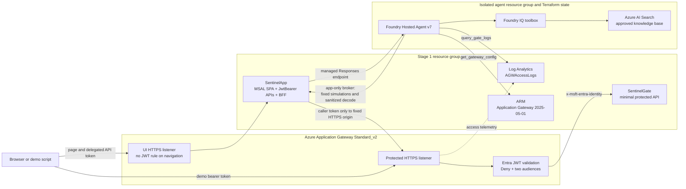
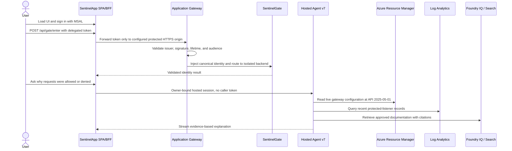

<p align="center">
  <a href="https://skillicons.dev">
    
  </a>
</p>

<h1 align="center">JWT Sentinel</h1>

<h3 align="center">JWT validation at the edge, explained by a Foundry Hosted Agent grounded with Foundry IQ</h3>

**Learn how to offload Microsoft Entra JWT validation to Azure Application Gateway, isolate the protected backend, and use an evidence-driven agent to explain the live policy and its outcomes.**

JWT Sentinel is an educational Azure deployment built around a real security boundary. A static MSAL SPA signs users in, Application Gateway validates tokens on a dedicated protected listener, and a minimal SentinelGate backend accepts only the gateway-injected canonical identity. The Gate Explainer reads the actual gateway configuration and access logs, decodes sanitized token evidence, and runs controlled allow/deny scenarios.

The validated environment currently runs **Foundry Hosted Agent version 7** with **Foundry IQ**. The in-process Microsoft Agent Framework 1.15 implementation remains available as the immediate, Terraform-controlled rollback path.

## Architecture



### Why two hostnames and two Container Apps?

Browsers do not attach an `Authorization` header to ordinary page navigation. Putting the SPA behind the gateway's `Deny` rule would prevent the sign-in page from loading. JWT Sentinel therefore separates the UI and protected planes structurally:

| Plane | Default hostname | Backend | Validation |
| --- | --- | --- | --- |
| UI and explanation | `sentinel.<domain>` | SentinelApp | ASP.NET Core JwtBearer on `/api/*` |
| Protected demonstration | `sentinel-api.<domain>` | SentinelGate | Application Gateway JWT Validation with `Deny` |

The UI listener routes only to SentinelApp. The protected listener routes only to SentinelGate. Both Container Apps restrict ingress to the Application Gateway frontend and NAT egress public IPs.

Application Gateway keeps each Container App FQDN as the backend `Host` and TLS/SNI name through `pickHostNameFromBackendAddress = true`. SentinelGate strictly parses `x-msft-entra-identity` as two canonical, non-empty GUIDs and verifies the tenant. `x-original-host` is supplementary client-originated routing context only—it is never authentication or proof that JWT validation occurred.

## Repository layout

```text
infra/                         Stage 1 Terraform: gateway, Entra, network, ACA, DNS
agent-infra/                   permanently isolated Hosted Agent/IQ foundation state
src/SentinelApp/               .NET 10 SPA, authenticated APIs, BFF, agent router
src/SentinelGate/              .NET 10 minimal protected backend
src/SentinelHostedAgent/       Hosted Agent v7 source and evidence-tool contracts
knowledge/                     versioned, allowlisted Foundry IQ corpus definition
evaluation/                    hosted-agent datasets and evaluator configuration
scripts/                       deploy, certificate, demo, knowledge, and static checks
tests/                         SentinelApp, SentinelGate, Hosted Agent, and Pester tests
docs/                          architecture, ADRs, runbooks, field notes, and test matrix
```

## Prerequisites

- Terraform 1.9 or newer.
- Azure CLI authenticated to the intended subscription and tenant.
- PowerShell 7 and the .NET 10 SDK.
- Control of two new public DNS hostnames.
- Permissions to create the documented Azure resources, Entra applications, identities, and least-privilege role assignments.
- A reviewed, pinned Posh-ACME version for certificate issuance.
- Azure Developer CLI with the `microsoft.foundry` extension only for the separately gated Hosted Agent deployment workflow.

Always use a new prefix, resource group, hostnames, three Entra applications, certificate name, and isolated Terraform state. Never copy state, `.terraform/`, populated tfvars, secrets, certificates, backend keys, or the original repository remote into a clean rebuild.

For repository-only validation, initialize providers without configuring a deployment backend:

```powershell
terraform -chdir=infra fmt -check -recursive
terraform -chdir=infra init -backend=false
terraform -chdir=infra validate
```

`terraform init -backend=false` was run locally for validation. No Azure backend or remote state was initialized by that check; a real plan must use the separately reviewed local state path or explicitly approved unique remote backend key.

## Deploy

The authoritative procedure and approval gates are in the [deployment runbook](docs/DEPLOYMENT-RUNBOOK.md). The abbreviated path below is intentionally review-first.

### 1. Plan and apply Stage 1 infrastructure

```powershell
Copy-Item infra/terraform.tfvars.example infra/terraform.tfvars
# Edit terraform.tfvars with new-environment values.

terraform -chdir=infra init
terraform -chdir=infra validate
terraform -chdir=infra plan -out=tfplan
terraform -chdir=infra show -no-color tfplan

# Apply only after confirming the subscription, tenant, state path,
# resource group, hostnames, and create-only plan.
terraform -chdir=infra apply tfplan
```

Terraform creates the VNet, NAT Gateway, public IPs, Key Vault bootstrap certificate, Log Analytics, three Entra applications, Foundry/Azure AI model deployment, ACR, two Container Apps, DNS records when configured, and Application Gateway through AzAPI `Microsoft.Network/applicationGateways@2025-05-01`.

### 2. Build and deploy both application images

```powershell
./scripts/deploy-app.ps1 `
  -ResourceGroup <resource-group> `
  -AcrName <acr-name> `
  -AppName <sentinel-app-name> `
  -GateAppName <sentinel-gate-name> `
  -UiHost <ui-hostname> `
  -ApiHost <protected-hostname> `
  -ApiClientId <api-client-id>
```

The script builds both images in ACR, updates only their respective Container Apps, and verifies the new revisions through the correct listeners.

### 3. Replace the bootstrap certificate

Certificate issuance defaults to Let's Encrypt staging:

```powershell
./scripts/issue-cert.ps1 `
  -Domain contoso.com `
  -UiHost sentinel.contoso.com `
  -ApiHost sentinel-api.contoso.com `
  -KeyVaultName <key-vault-name> `
  -CertName <certificate-name> `
  -DnsZoneSubscriptionId <subscription-id> `
  -PoshAcmeVersion <reviewed-version>
```

Production issuance requires the explicit `-AcmeEnvironment Production` option and its approval gate. The script imports a new version under the same unversioned Key Vault certificate name. It never restarts Application Gateway automatically.

### 4. Validate the protected listener

```powershell
./scripts/demo.ps1 `
  -ApiHost sentinel-api.contoso.com `
  -TenantId <tenant-id> `
  -ApiClientId <api-client-id> `
  -DaemonClientId <daemon-client-id> `
  -DaemonSecret <daemon-secret>
```

The expected matrix is:

| Scenario | Expected result |
| --- | ---: |
| No token | 401 |
| Genuine Entra token for the wrong audience | 401 |
| Correct API-audience token | 200 from SentinelGate |
| Tampered token | 401 |

A successful response must contain the expected SentinelGate schema and tenant, canonical tenant/object GUIDs, `gatewayValidated: true`, and `routingContextConsistent: true`.

### 5. Add the Hosted Agent and Foundry IQ

Stage 1 is independently usable with the embedded agent. The Hosted Agent, Search knowledge plane, monitoring, evaluations, and RBAC live permanently in a separate resource group and `agent-infra` state. Follow the [agent implementation plan](docs/AGENT-IMPLEMENTATION-PLAN.md) and [switch guide](docs/HOSTED-AGENT-SWITCH.md); do not merge the states or run `azd provision` over Terraform-owned resources.

## Demo storyline



Try asking:

> Inspect the live gateway configuration and explain why three of the four sample requests were denied.

The agent must use live tools when current configuration or logs are requested. It must distinguish token decoding from cryptographic validation and must never invent settings, log entries, or citations.

## Agent tools and Foundry IQ

| Capability | Evidence source and boundary |
| --- | --- |
| `decode_token` | SentinelApp decodes locally, stores only bounded sanitized evidence, and gives the Hosted Agent a short-lived opaque handle |
| `get_gateway_config` | ARM GET of Application Gateway API `2025-05-01` using the dedicated agent identity |
| `query_gate_logs` | Query-only access to protected-host `/enter` records in Log Analytics |
| `simulate_gate_request` | One of four fixed scenarios through SentinelApp's app-only broker and configured protected origin |
| Foundry IQ | Azure AI Search retrieval over the approved repository documents and selected Microsoft Learn sources, with citations |

The Hosted Agent identity has only the scoped gateway, Log Analytics, and Search read permissions it requires. SentinelGate still has ACR pull only. Raw caller tokens, daemon secrets, Terraform state, and certificate material are excluded from Hosted sessions and the IQ corpus.

## Switching Hosted and Embedded modes

The execution mode is operator-controlled configuration—not a browser button or public API:

```hcl
agent_mode = "Hosted"   # active managed endpoint
# agent_mode = "Embedded" # in-process rollback implementation
```

Changing the file alone does nothing in Azure. Produce and review a Terraform plan, then apply only the SentinelApp configuration revision. A mode switch must not modify or restart Application Gateway. Never silently fall back from Hosted to Embedded inside a request.

## Field notes: the important gotchas

1. **The gateway subnet needs explicit outbound connectivity.** Keep the NAT Gateway so JWT validation can reach Entra endpoints.
2. **NAT changes the backend source IP.** Both Container Apps must allow the gateway frontend public IP and NAT public IP.
3. **Never use `az network application-gateway update`.** An older management API can silently remove the preview JWT configuration. Use the existing AzAPI resource at `2025-05-01`.
4. **A gateway restart requires recovery validation.** After an explicitly approved restart, increment `gateway_config_generation`, review the full in-place AzAPI update, apply it, and rerun the entire matrix.
5. **Preserve the API identifier-URI lifecycle safeguard.** Without `ignore_changes = [identifier_uris]`, later Entra application updates can break `api://<clientId>` token acquisition.
6. **A matching `x-original-host` is not authentication.** It is client-originated routing context; the dedicated listener, JWT `Deny` rule, isolated backend, ingress boundary, and injected-identity parsing form the trust boundary.
7. **Hosted Agent and Foundry IQ are preview dependencies.** Keep the embedded implementation, bounded retry rules, telemetry, evaluation evidence, and independent cost ownership until sustained parity is accepted.

See the [field notes](docs/FIELD-NOTES.md) for reproduced symptoms, evidence, and recovery procedures.

## Preview and operational caveats

- Application Gateway JWT Validation and parts of the Hosted Agent/IQ stack are preview capabilities; verify current Azure terms and regional availability.
- JWT Validation authenticates the token at the edge; application authorization still belongs in the application.
- Log Analytics ingestion can lag by several minutes. An HTTP denial alone does not prove that the backend was untouched.
- SentinelApp remains at one replica while Hosted session mappings are in memory.
- The current Terraform provider reports an `azurerm_ai_services` deprecation warning. Its migration is deferred to a separately reviewed, no-replacement change.
- The locally vendored MSAL browser library is intentional; do not replace it with an unverified CDN reference.

## Cost and cleanup

Billable resources include Application Gateway Standard_v2, NAT Gateway and public IPs, Container Apps, Container Registry, Log Analytics, Key Vault, Azure AI Search, Foundry/Azure AI model usage, and monitoring/evaluation telemetry.

Cleanup spans two independent Terraform states and deliberately protected resources. Do not run a blind destroy. Follow the deployment runbook's cleanup approval gate, review DNS and Entra ownership, and inspect both destroy plans. Application Gateway has `prevent_destroy` protection that must never be removed casually.

## Documentation

- [Architecture](docs/ARCHITECTURE.md) — implemented topology and trust boundaries.
- [Decisions](docs/DECISIONS.md) — accepted ADRs and ownership boundaries.
- [Deployment runbook](docs/DEPLOYMENT-RUNBOOK.md) — clean deployment, certificates, validation, recovery, and cleanup.
- [Test matrix](docs/TEST-MATRIX.md) — end-to-end acceptance checklist.
- [Operator guide](docs/OPERATOR-GUIDE.md) — daily use, gateway and Agent checks, IQ grounding/telemetry validation, troubleshooting, and safe mode switching.
- [Field notes](docs/FIELD-NOTES.md) — verified preview behavior and operational discoveries.
- [Agent migration design](docs/AGENT-MIGRATION.md) — permanent isolation, RBAC, evaluation, rollback, and cost model.
- [Agent implementation plan](docs/AGENT-IMPLEMENTATION-PLAN.md) — completed foundation and Gates 1–5.
- [Hosted Agent switch guide](docs/HOSTED-AGENT-SWITCH.md) — Hosted/Embedded promotion and rollback procedure.
- [DESIGN.md](DESIGN.md) — historical design context; implemented choices above take precedence where they differ.

---

**Made with ❤️ by [Konstantinos Passadis](https://github.com/passadis)**
