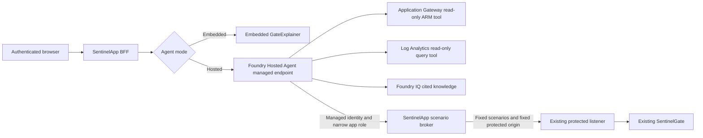

# Foundry Hosted Agent and Foundry IQ Migration Design

**Status:** Accepted and implemented; retained as the public migration rationale

## Purpose

This document records the reversible migration of the Stage 1 in-process GateExplainer to a Foundry Hosted Agent, with Foundry IQ providing cited static knowledge. Commands and resource names are intentionally environment-neutral; this design is not authorization for an Azure mutation.

The migration preserves these invariants:

- the deployed JWT Sentinel gateway and two-Container-App architecture remain unchanged;
- SentinelGate remains the only backend for the protected listener;
- SentinelApp remains the browser-facing authenticated BFF and the deterministic scenario executor;
- the embedded Microsoft Agent Framework 1.15 implementation remains available until hosted parity is demonstrated and explicitly accepted;
- hosted-agent infrastructure always remains in a separate resource group and Terraform state from Stage 1.

## Target architecture

The browser never invokes the hosted endpoint directly. SentinelApp authenticates the user, owns the browser-to-agent session mapping, invokes the managed endpoint with its managed identity, and streams the response back to the authenticated browser. A browser-supplied conversation identifier must never grant access to another user's session.

The hosted agent may read live gateway configuration and Log Analytics evidence. Foundry IQ supplies curated static knowledge and citations; it is not a substitute for live configuration, live logs, JWT validation, or an observed scenario result.

## Permanent infrastructure and state isolation

The hosted-agent foundation will be a new Terraform root, proposed as `agent-infra/`, with its own provider lock file, variables, outputs, lifecycle, and backend configuration. It will use:

- a dedicated agent resource group;
- a separately approved local state path or unique remote backend key such as `jwt-sentinel-v2/<environment>-agent.tfstate`;
- a Foundry account/project as required by the supported Hosted Agent path;
- a model deployment, Azure AI Search, versioned knowledge corpus, Application Insights, and any agent-specific Log Analytics resources;
- agent-specific budgets, alerts, tags, identities, and role assignments.

This state will never be merged into `infra/`, and `infra/` will never consume it through `terraform_remote_state`. Integration values such as the managed endpoint, project identifier, deployment name, and agent name/version will cross the boundary only as reviewed, explicit, non-secret application configuration.

| Owner | Resources and behavior |
|---|---|
| Existing `infra/` state | Application Gateway, networking, DNS, certificates, SentinelApp, SentinelGate, existing Entra apps, and Stage 1 infrastructure |
| New agent Terraform state | Agent resource group, Foundry foundation, Search and knowledge storage, observability, budgets, identities, and read-only cross-resource assignments |
| Hosted-agent deployment workflow | Immutable hosted-agent code versions deployed directly from source into the Terraform-created Foundry project |
| SentinelApp deployment workflow | Embedded/hosted mode and endpoint configuration, plus application code for hosted invocation and the scenario broker |

The hosted-agent deployment workflow must target the exact Terraform-created Foundry project. It must not provision a competing project or take ownership of Terraform-managed resources. Agent versions remain independently deployable and reversible. The initial .NET deployment uses the supported direct source/ZIP path, so a customer-owned ACR is not provisioned unless a reviewed runtime requirement later makes one necessary.

## Reusing the C# Agent Framework implementation

The hosted implementation will use .NET 10 and the existing Microsoft Agent Framework 1.15 behavior rather than replacing the agent with a prompt-only reconstruction. Migration work should first separate reusable behavior from hosting concerns:

- preserve the GateExplainer system instructions and evidence rules;
- preserve the names, argument contracts, and output semantics of `decode_token`, `get_gateway_config`, `query_gate_logs`, and `simulate_gate_request`;
- put shared instructions, response contracts, and tool result schemas in a host-neutral library;
- retain separate adapters for the embedded SentinelApp host and the Foundry Hosted Agent runtime;
- keep the embedded implementation buildable and testable throughout the migration.

Raw bearer tokens must not be copied into hosted prompts, Foundry sessions, traces, evaluation datasets, or knowledge indexes. Token decoding and caller-token replay remain inside SentinelApp. The hosted agent receives only sanitized claim evidence or a short-lived, user-bound evidence handle that SentinelApp resolves after authorization.

## Tool placement and trust

| Capability | Execution location | Authority and evidence |
|---|---|---|
| Decode a token | SentinelApp | Local, non-validating decode; sanitized claims only leave the BFF |
| Read gateway policy | Hosted agent tool | Dedicated agent identity, Reader scoped to the existing Application Gateway resource |
| Query gateway logs | Hosted agent tool | Dedicated agent identity, Log Analytics Reader scoped to the existing workspace |
| Retrieve documentation | Foundry IQ | Query-only Search permission; cited results from the approved corpus |
| Run deterministic scenarios | SentinelApp broker | Fixed scenario enumeration, fixed HTTPS protected origin and path, existing credential handling |
| Replay the signed-in user's token | SentinelApp only | Current authenticated request; never exposed to the hosted agent |

The scenario broker is a narrow application API, not a general HTTP proxy. It accepts an allowlisted scenario name and bounded parameters, cannot accept a caller-selected host, path, scheme, headers, or token, and returns a sanitized evidence contract. It authenticates the hosted agent's managed identity using a dedicated Entra application role. That application role is not Azure RBAC and grants no Azure resource-management permission.

Shadow comparison must not execute scenarios twice. It uses recorded, sanitized tool evidence or explicitly read-only tools so that comparing embedded and hosted answers cannot duplicate token acquisition, traffic generation, or other side effects.

## Identities and least privilege

The hosted runtime receives a dedicated managed identity. Its Azure RBAC is limited to:

- `Reader` scoped to the existing Application Gateway resource, not the resource group or subscription;
- `Log Analytics Reader` scoped to the existing JWT Sentinel workspace;
- query-only Search data access, normally `Search Index Data Reader`, scoped to the new Search service or approved indexes;
- the minimum Foundry/model execution permission required inside its own project.

The agent identity receives no Key Vault access, daemon secret, Container Apps management permission, DNS permission, Entra directory administration, Terraform state access, Contributor, Owner, or subscription-wide Reader role. Its narrow scenario-broker app role is reviewed separately from Azure RBAC.

Knowledge publication uses a separate ingestion identity. Any Search index-management or storage-write permission needed to publish the corpus belongs to that identity or a controlled deployment principal, never to the hosted runtime identity.

SentinelApp's existing managed identity receives only the permission required to invoke the managed hosted-agent endpoint. It does not receive Search administration or agent-infrastructure management permission.

The initial invocation role is `Foundry Agent Consumer`, scoped to the hosted agent when supported. SentinelApp does not receive user-identity impersonation permission; it remains responsible for binding each authenticated user to a server-side conversation reference.

Because a hosted deployment may create its runtime principal only after the first agent version is deployed, RBAC bootstrap is intentionally staged:

1. Terraform creates and plans the isolated foundation.
2. The agent deployment creates an immutable hosted version and runtime identity.
3. The resulting principal ID is passed explicitly to the agent Terraform root.
4. A separate, reviewed RBAC-only plan assigns the narrow roles above.

No state file is read across the Stage 1 and agent stacks to discover this identity.

## Foundry IQ corpus and citations

The initial repository corpus is an explicit allowlist:

- `docs/AGENT-MIGRATION.md`;
- `README.md`;
- `docs/ARCHITECTURE.md`;
- `docs/DECISIONS.md`;
- `docs/FIELD-NOTES.md`;
- `docs/DEPLOYMENT-RUNBOOK.md`;
- `docs/TEST-MATRIX.md`.

The initial Microsoft Learn allowlist is:

- [Azure Application Gateway overview](https://learn.microsoft.com/azure/application-gateway/overview);
- [Microsoft Entra access-token claims](https://learn.microsoft.com/entra/identity-platform/access-token-claims-reference);
- [Validate Microsoft Entra claims](https://learn.microsoft.com/entra/identity-platform/claims-validation);
- [Azure Container Apps IP ingress restrictions](https://learn.microsoft.com/azure/container-apps/ip-restrictions);
- [Troubleshoot Application Gateway Key Vault certificates](https://learn.microsoft.com/troubleshoot/azure/application-gateway/troubleshoot-application-gateway-key-vault-certificate);
- [Develop a hosted agent with the Microsoft Agent Framework](https://learn.microsoft.com/azure/foundry/how-to/develop/framework-hosted-agents);
- [Hosted Agents concepts](https://learn.microsoft.com/azure/foundry/agents/concepts/hosted-agents);
- [Agent limits, quotas, and regions](https://learn.microsoft.com/azure/foundry/agents/concepts/limits-quotas-regions);
- [Foundry IQ overview](https://learn.microsoft.com/azure/foundry/agents/concepts/what-is-foundry-iq);
- [Connect a Foundry IQ knowledge base](https://learn.microsoft.com/azure/foundry/agents/how-to/foundry-iq-connect).

Learn content must retain its canonical source URL and retrieval date. Adding or replacing a source requires corpus review rather than unrestricted crawling.

Publication is allowlist-based, versioned, and reproducible. Each document carries source, repository revision or retrieval date, classification, and canonical URL metadata. The initial corpus contains operational documentation, not operational data.

The following are excluded: `docs/history/`, archived session JSONL, Terraform state and plans, populated tfvars, backend configuration, certificates, tokens, secrets, deployment logs, gateway logs, user conversations, and arbitrary uploaded documents.

Answers based on IQ must include resolvable citations to approved sources. The agent must say when no adequate source was retrieved. It must distinguish cited static guidance from live ARM configuration, live telemetry, decoded claims, and observed HTTP results.

## Embedded/hosted configuration switch

The production switch is server-side and reversible. Proposed modes are:

- `Embedded` — default and rollback mode; current in-process GateExplainer handles all requests;
- `HostedShadow` — validation-only mode for authorized testers; the embedded response remains user-visible and hosted comparison uses sanitized, non-side-effecting evidence;
- `Hosted` — hosted response is user-visible after all parity gates are accepted.

The browser cannot choose the mode or override the hosted endpoint. SentinelApp accepts only a configured HTTPS Foundry endpoint from an allowlisted Azure domain and does not forward the user's bearer token to it. Endpoint configuration is non-secret; authentication uses managed identity.

A mode change updates SentinelApp configuration/revision only. It must not update, restart, or reconfigure Application Gateway, networking, SentinelGate, DNS, or listener certificates.

## Sessions and continuity

SentinelApp remains the session authority for the browser. It binds each hosted conversation to the authenticated tenant/object identifier, applies the current expiry and capacity limits, and stores only the minimum hosted conversation reference needed to continue a session. Conversation references are opaque to the browser or are cryptographically and server-side bound to the owner.

Parity testing must prove:

- multiple turns retain the expected context;
- session expiry starts a clean hosted conversation;
- one user cannot resume, enumerate, or infer another user's session;
- retries are idempotent where possible and do not repeat scenario execution;
- provider timeouts, not-ready responses, and transient errors produce bounded failure behavior and an explicit fallback choice rather than silently changing evidence.

Hosted sessions can remove the long-term single-replica constraint, but SentinelApp remains at one replica until session ownership and continuity have passed the migration gates.

## Tracing, privacy, and operational evidence

Agent tracing is isolated in agent-owned Application Insights and Log Analytics resources. Traces should correlate a SentinelApp request, hosted conversation, tool call, citation retrieval, and sanitized result without recording access tokens, daemon secrets, complete authorization headers, raw pasted JWTs, or unredacted sensitive tool payloads.

The design records:

- agent name and immutable version;
- model deployment and prompt/tool contract revision;
- tool selection, duration, success, and bounded sanitized result metadata;
- retrieval query, source identifiers, citation coverage, and retrieval duration;
- end-to-end latency, first-token latency, token usage, error class, and retry count;
- embedded or hosted mode and explicit fallback events.

Diagnostic retention, sampling, and access are configured in the agent stack. Tracing is evidence for operation and evaluation; it must not become a token archive.

## Evaluation and parity gates

Evaluation starts with a versioned, secret-free dataset derived from the existing acceptance matrix and documented operational questions. It includes positive, negative, ambiguous, delayed-log, and prompt-injection cases.

Hosted mode cannot become the default until all of these gates pass:

1. **Tool parity:** all four current capabilities return equivalent evidence contracts, and deterministic scenarios remain in SentinelApp.
2. **Security:** no raw token or secret reaches prompts, sessions, traces, evaluations, Search, or citations; session-owner isolation and broker authorization tests pass.
3. **Grounding:** factual documentation claims have valid citations to the allowlisted corpus, unsupported questions are acknowledged, and live facts are obtained from live tools rather than IQ.
4. **Correctness:** the agent distinguishes decoding from validation, expected behavior from observation, routing context from authentication proof, and delayed telemetry from proof of backend reachability.
5. **Continuity:** multi-turn, expiry, retry, concurrency, and cross-user isolation tests pass.
6. **Resilience:** hosted cold start, deployment-not-ready, timeout, quota, Search outage, and tool failure behavior is bounded and observable.
7. **Latency:** warm and cold distributions are measured separately against the current embedded baseline. A concrete p50/p95 budget is approved only after measurements; it is not invented in this design.
8. **Cost:** model tokens, hosted session compute, Search, knowledge storage, telemetry, and evaluator-model usage are measured and remain inside an approved lab budget.
9. **Regression:** the complete JWT Sentinel browser, BFF, protected-listener, log, Agent, and trusted-TLS matrix remains green with no gateway change.

Suggested evaluation dimensions include task adherence, tool-call selection and arguments, evidence faithfulness, citation correctness and completeness, retrieval relevance, intent resolution, indirect prompt-attack resistance, answer usefulness, latency, and per-session cost.

## Cost ownership

All new agent-platform costs are charged, tagged, reported, and budgeted in the agent resource group. The agent stack must create budget alerts before sustained testing and expose enough telemetry to separate:

- Hosted Agent session CPU and memory;
- model input/output tokens;
- AI Search and knowledge storage;
- Application Insights and Log Analytics ingestion/retention;
- evaluation and judge-model tokens.

The planning pass must provide a current Azure pricing estimate and an approved monthly lab cap. No cost estimate in repository documentation should be treated as a quote. Existing Application Gateway and Stage 1 resource costs remain owned by the Stage 1 resource group and are not attributed to the migration.

## Preview exposure

Foundry Hosted Agents are currently a preview capability. Foundry IQ capabilities span generally available and preview API surfaces; the implementation should use generally available APIs where they satisfy the design and isolate any required preview feature behind explicit versions and tests.

Preview risks include API and SDK changes, region or quota constraints, hosted cold starts, identity timing, endpoint behavior changes, diagnostic schema changes, and no production SLA assumption. The exact region, supported .NET runtime, API versions, quotas, and role requirements must be reverified against official documentation immediately before planning and deployment.

This migration does not alter the separate preview exposure of Application Gateway JWT Validation.

## Rollback

Rollback is an application configuration operation:

1. set the SentinelApp agent mode to `Embedded`;
2. deploy or activate the reviewed SentinelApp revision;
3. verify embedded chat, tools, sessions, and the full JWT Sentinel matrix;
4. leave the independent agent stack deployed for diagnosis or destroy it later only through its own reviewed state and approval process.

Rollback never restarts or updates Application Gateway. The embedded implementation, dependencies, tests, and operational instructions remain until hosted parity has been sustained for an explicitly approved observation period. Removing the embedded path requires a new ADR.

## Phased implementation and approval gates

### Phase 0 — Design approval

Approve this document, the ADR, exact resource ownership, corpus, identity scopes, session model, evaluation gates, cost cap, and rollback.

Concrete values belong in ignored environment configuration and reviewed plans, not public documentation.

### Phase 1 — Isolated planning

Create the new agent Terraform root and hosted-agent project scaffolding. Run local validation and an isolated plan only. The plan may read identifiers of existing shared resources but must not update, replace, or destroy them. It must not contain gateway, network, DNS, certificate, SentinelGate, or existing Container App changes.

### Phase 2 — Independent hosted deployment

Provision the approved agent foundation, deploy an immutable hosted version, apply the reviewed read-only RBAC bootstrap, and test through its managed endpoint without connecting SentinelApp.

### Phase 3 — IQ publication and evaluation

Publish only the approved corpus, test citations and retrieval boundaries, run the evaluation suite, measure session continuity, latency, and cost, and document failures and mitigations.

### Phase 4 — Reversible SentinelApp integration

Add the managed-endpoint client, scenario broker, session binding, and server-side mode. Start in `Embedded`, then use controlled `HostedShadow`, and promote to `Hosted` only after explicit parity approval. No gateway infrastructure change is permitted.

### Phase 5 — Observation

Run both paths during the approved observation period. Preserve the embedded rollback. The agent infrastructure and state remain permanently separate regardless of migration success.

## Implementation outcome

The migration was completed through the phases above: first preserving `Embedded`, then deploying and evaluating the isolated Hosted Agent and IQ stack, then using allowlisted `HostedShadow`, and finally promoting `Hosted` after tool, citation, session, security, latency, telemetry-redaction, and rollback checks passed. The embedded implementation remains present as the operator-controlled rollback path.

Future environments must still choose their own region, state location, cost cap, model capacity, Search topology, immutable agent version, and observation thresholds. Those values must be reviewed at deployment time and must not be copied from another environment.

## Authoritative implementation references

- [Develop a hosted agent with the Microsoft Agent Framework](https://learn.microsoft.com/azure/foundry/how-to/develop/framework-hosted-agents)
- [Hosted Agents concepts](https://learn.microsoft.com/azure/foundry/agents/concepts/hosted-agents)
- [Agent limits, quotas, and regions](https://learn.microsoft.com/azure/foundry/agents/concepts/limits-quotas-regions)
- [Foundry IQ overview](https://learn.microsoft.com/azure/foundry/agents/concepts/what-is-foundry-iq)
- [Connect a Foundry IQ knowledge base](https://learn.microsoft.com/azure/foundry/agents/how-to/foundry-iq-connect)
- [Microsoft Entra access-token claims](https://learn.microsoft.com/entra/identity-platform/access-token-claims-reference)
- [Validate Microsoft Entra claims](https://learn.microsoft.com/entra/identity-platform/claims-validation)
