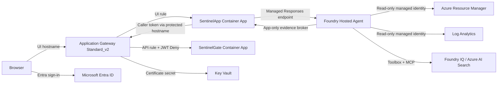

# JWT Sentinel Stage 1 Architecture

## Scope

This document describes the implemented topology without deployment-specific identifiers. Stage 1 uses two Azure Container Apps behind one Azure Application Gateway. SentinelApp routes GateExplainer requests to an immutable Foundry Hosted Agent version through `AGENT_MODE=Hosted`; the in-process Microsoft Agent Framework implementation remains intact as the immediate rollback path.

Foundry Agent and IQ infrastructure stays permanently isolated from Stage 1 infrastructure in its own resource group and Terraform state. The Hosted client fails closed on explicit failed or incomplete stream events, with one fresh-session retry limited to safe, read-only, zero-output protocol failures. Promoting or rolling back the Agent changes only SentinelApp configuration and does not modify or restart Application Gateway.

## System context

The gateway has separate listeners, rules, pools, probes, and backend HTTP settings for SentinelApp and SentinelGate. There is no cross-routing between the two application planes.

## Runtime components

### SentinelApp

SentinelApp is the UI, control, and explanation plane. It provides:

- the static MSAL.js SPA;
- ASP.NET Core JwtBearer authentication;
- delegated `access_as_user` authorization for all `/api/*` endpoints;
- the `/api/gate/enter` BFF endpoint;
- a server-side router for `Embedded`, `HostedShadow`, and `Hosted` modes;
- the Microsoft Agent Framework 1.15 embedded rollback implementation;
- local token decoding and bounded sanitized-evidence staging;
- app-only evidence-broker routes for the Hosted Agent;
- controlled missing, valid, wrong-audience, tampered, and caller-replay simulations.

SentinelApp uses a user-assigned managed identity for ACR pull and the narrowly scoped permissions needed to invoke the Hosted Agent. Its daemon credential is stored as a Container App secret for controlled simulations and is never passed to the browser or either Agent implementation. The Hosted Agent has its own identity for resource-scoped gateway, Log Analytics, and Search reads.

Agent sessions are stored in process, bound to the authenticated tenant/object pair, serialized per session, limited to 250 active entries, and expired after 30 minutes. SentinelApp therefore has exactly one replica in Stage 1.

### SentinelGate

SentinelGate is a small stateless .NET 10 Minimal API exposing:

- `GET /healthz`;
- `POST /enter`.

It has no Agent Framework, Foundry, Log Analytics, ARM Reader, daemon credential, SPA, or simulation dependency. Its managed identity has ACR pull only.

For `/enter`, SentinelGate requires exactly one gateway-injected `x-msft-entra-identity` value in canonical `tenantId:objectId` form. Both values must be non-empty `D`-format GUIDs and the tenant must match configuration. Duplicate, empty, malformed, noncanonical, or unexpected-tenant values are rejected.

## Listener and backend isolation

| Listener | Hostname | Rule | Backend | Gateway JWT validation |
|---|---|---|---|---|
| UI HTTPS | `sentinel.<domain>` | `ui-rule` | SentinelApp pool | None on page navigation |
| Protected HTTPS | `sentinel-api.<domain>` | `api-rule` | SentinelGate pool | `Deny` |
| UI HTTP | `sentinel.<domain>` | redirect rule | UI HTTPS listener | Not applicable |

The JWT policy accepts both `api://<api-client-id>` and the bare API client ID. The protected routing rule explicitly references that policy. The UI rule has no SentinelGate route; the protected rule has no SentinelApp route.

Each backend has its own `/healthz` probe and HTTPS backend settings. `pickHostNameFromBackendAddress = true` is intentional: Application Gateway uses the corresponding Container App FQDN as the backend `Host` header and TLS/SNI name.

`x-original-host` originates with client routing context. SentinelGate may require it to match the configured protected public hostname as a fail-closed consistency check, but that match is not authentication and is not proof of JWT validation.

## Trust boundaries

The SentinelGate identity header is trusted only within the combined boundary formed by:

1. the dedicated protected Application Gateway listener;
2. the JWT `Deny` configuration attached to that listener's rule;
3. the dedicated SentinelGate backend pool with no UI-listener route;
4. Container Apps ingress restricted to Application Gateway egress addresses;
5. strict canonical parsing and tenant checking of `x-msft-entra-identity`.

The Container Apps are externally addressable because Application Gateway reaches their public FQDNs, but ingress allows only the gateway frontend public IP and NAT Gateway public IP. Direct requests from unapproved public sources must be blocked.

## Request flows

### UI API

1. The SPA signs in through Entra authorization code with PKCE.
2. It acquires the delegated API token.
3. SentinelApp validates issuer, audience, signature, lifetime, and `access_as_user`.
4. `/api/whoami`, Agent, tool, and BFF endpoints run only under that policy.

### Enter the Gate

1. The SPA calls authenticated `POST /api/gate/enter` on SentinelApp.
2. SentinelApp obtains the bearer token from the current authenticated request.
3. GateForwarder sends it only to the configured standard-port HTTPS protected DNS origin at `/enter`; the caller cannot supply a target host, path, or scheme.
4. Application Gateway validates the JWT under the protected rule.
5. Allowed traffic reaches SentinelGate with the injected Entra identity.
6. SentinelGate validates the canonical identity and supplementary routing context.
7. SentinelApp accepts only the expected SentinelGate schema, configured tenant, non-empty canonical GUIDs, and both boolean evidence flags.
8. The SPA presents the result and sends only a token-free allowlisted summary to the Agent for explanation.

### Agent evidence

The GateExplainer distinguishes:

- verified evidence: live configuration, decoded claims, observed HTTP response, SentinelGate payload, injected identity, or log row;
- inference: expected behavior derived from claims and live policy;
- unknowns: unavailable configuration, missing or delayed telemetry, or unverified signature state.

Token decoding never claims cryptographic validation. HTTP denial alone never proves backend non-reachability.

## Network and certificates

The Application Gateway subnet is attached to a NAT Gateway. Outbound HTTPS is required for Entra signing metadata and for the public Container App backends. Both NAT and frontend public IPs are retained in Container Apps ingress restrictions.

Application Gateway uses a user-assigned identity with Key Vault secret access. The listener references an unversioned Key Vault secret URI. Terraform creates the bootstrap certificate; `issue-cert.ps1` creates later versions under the same certificate name. Certificate issuance defaults to Let's Encrypt staging, and production must be selected explicitly.

## Terraform ownership and recovery

Application Gateway is a single `azapi_resource` using API `2025-05-01`; this preserves preview JWT properties not represented by the AzureRM gateway resource.

`gateway_config_generation` defaults to zero and affects only a visible tag on that same AzAPI resource. Incrementing it is an opt-in trigger that resubmits the complete resource body. `prevent_destroy = true` makes a proposed replacement or destruction fail rather than recreate the gateway. After an approved restart, operators must review the in-place update, apply it through the same AzAPI resource, verify the live JWT rule, and rerun the complete matrix.

Terraform owns initial Container App images but ignores later image drift because `deploy-app.ps1` owns deployed image revisions. Certificate versions after bootstrap are similarly owned by `issue-cert.ps1`.

The repository currently uses fresh local state by default. A remote backend may be introduced only with an explicitly approved, unique key. `.terraform.lock.hcl` is committed; `.terraform/`, state, tfvars, plans, backend configuration, and generated sensitive material are ignored.

## Stage boundary

Stage 1 retains the in-process Agent Framework implementation but does not own the Foundry Hosted Agent, Foundry IQ knowledge source, hosted identity, Search service, or agent telemetry. Those components remain in a permanently separate resource group and `agent-infra` state and have no route through Application Gateway. SentinelApp pins a reviewed immutable Hosted Agent endpoint/version pair and can restore `Embedded` without modifying the gateway.

The published IQ corpus, Search index, knowledge source, knowledge base, RemoteTool connection, and toolbox are agent-stack artifacts. The Hosted Agent identity has only the resource-scoped gateway, Log Analytics, and Search-reader permissions required by its tools. Publication uses a separate operator-controlled identity with write access. Connection credentials remain in sensitive state and are not emitted as outputs.

The integration boundary keeps `/api/agent/chat` and `/api/agent/reset` stable behind the SPA's delegated policy. A server-only router supports `Embedded`, `HostedShadow`, and `Hosted`; an absent setting fails safely to `Embedded`. `HostedShadow` additionally requires an operator-configured allowlist of canonical Entra object IDs. The browser cannot select the mode, tester identity, endpoint, or version.

Hosted sessions are keyed by authenticated owner plus browser session GUID and retain only opaque Foundry session/conversation identifiers and a server-derived pseudonymous identity. Reset or expiry removes the complete mapping. A separate broker policy rejects delegated callers and requires the exact tenant, `agent.scenario.execute` application role, and configured Hosted Agent principal. Raw tokens remain local: SentinelApp produces bounded sanitized evidence and retains its short-lived opaque handle server-side. The [agent migration design](AGENT-MIGRATION.md) defines permissions, data governance, validation, and rollback.
